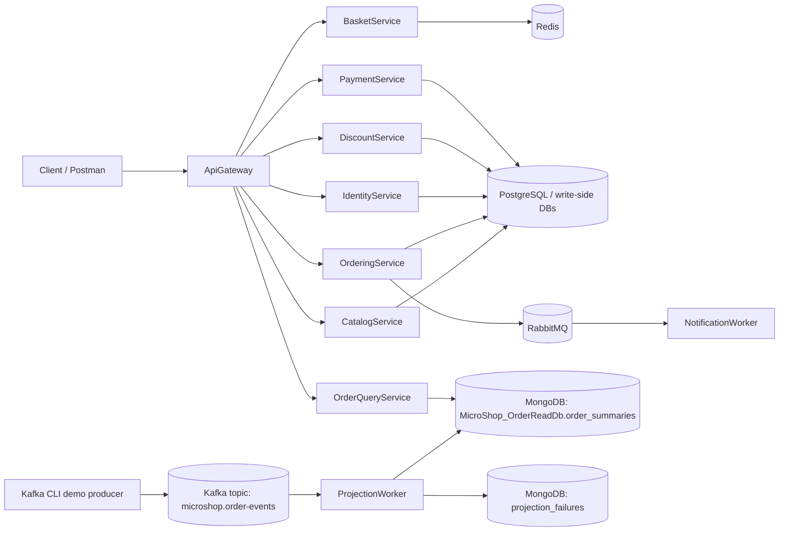

# Ngay 29: README + Architecture Diagram + ADR + API Surface Review

## 0. Why this version exists

This is the corrected source-of-truth version for Ngay 29.

Previous draft was directionally right but needed repo-aware fixes:

```text
- Do not assume Swagger/OpenAPI is already enabled.
- README should be rewritten strongly because the current README is old/mojibake and missing current services.
- Runtime commands must separate projection lite demo and full system runtime.
- Do not create ADR docs disconnected from existing docs.
- README should say current focus/completed Ngay 29 after implementation, not completed Ngay 28.
- Commit/tag section should be optional after review.
```

Use this file as the main Ngay 29 plan.

---

## 1. Current repo context

Current important architecture:

```text
Services:
- CatalogService
- BasketService
- OrderingService
- DiscountService
- IdentityService
- PaymentService
- OrderQueryService
- ApiGateway

Workers:
- Services/NotificationWorker
- Workers/ProjectionWorker
```

Current infrastructure responsibilities:

```text
PostgreSQL:
    write-side relational persistence where applicable

Redis:
    Basket state/cache

RabbitMQ:
    workflow/task messaging
    NotificationWorker consumes RabbitMQ messages via MassTransit

Kafka:
    event stream/projection/read model learning
    ProjectionWorker consumes topic microshop.order-events

MongoDB:
    read model store
    database: MicroShop_OrderReadDb
    collection: order_summaries
    failure collection: projection_failures
```

Current read endpoints:

```text
GET /order-summaries
GET /order-summaries/{orderId}
```

Do not document old endpoint:

```text
/orders/read-model
```

---

## 2. Goal of Ngay 29

The goal is documentation and project presentation.

By the end:

```text
[ ] README.md is rewritten or heavily replaced to match the current repo.
[ ] Architecture diagram exists and does not overclaim features.
[ ] Communication decisions are updated.
[ ] Existing docs are cross-linked instead of ignored.
[ ] ADR index exists.
[ ] New ADRs are added only where helpful.
[ ] API surface is reviewed.
[ ] OpenAPI/Swagger status is checked, not assumed.
[ ] Demo script for Ngay 30 is prepared.
```

Main outputs:

```text
README.md
docs/architecture-diagram.md
docs/communication-decisions.md
docs/adr/README.md
docs/adr/ADR-001-service-communication.md
docs/adr/ADR-002-rabbitmq-vs-kafka.md
docs/adr/ADR-003-order-read-model-projection.md
docs/api-surface-review.md
docs/demo-script-foundation.md
```

Optional output if OpenAPI is actually enabled:

```text
docs/openapi-review.md
```

---

## 3. Scope guard

Do:

```text
[ ] Rewrite README to match current repo.
[ ] Add architecture diagram.
[ ] Add or update communication decision docs.
[ ] Add ADR index and cross-links to existing docs.
[ ] Review API surface and OpenAPI/Swagger availability.
[ ] Prepare Ngay 30 demo script.
```

Do not:

```text
[ ] Do not add Swagger/OpenAPI packages unless explicitly chosen as a code task.
[ ] Do not claim Swagger page exists before verifying it.
[ ] Do not add services.
[ ] Do not refactor ProjectionWorker.
[ ] Do not add Kafka DLT/retry topic.
[ ] Do not add OrderingService Kafka publisher.
[ ] Do not add production observability stack.
```

Rule:

```text
Docs must describe the repo truth.
Future work must be labeled as future work.
```

---

## 4. Pre-check before editing docs

Run:

```powershell
git status --short
```

Inspect docs and existing decisions:

```powershell
Get-ChildItem docs -Recurse
```

Look for existing docs such as:

```text
aspire-decision.md
docker-compose-decision.md
config-secrets-decision.md
0001-clean-architecture-baseline.md
```

Important rule:

```text
Do not delete or ignore old docs.
Create an ADR index or cross-link existing docs so the documentation system feels connected.
```

Check API/OpenAPI setup before writing OpenAPI claims:

```powershell
Select-String -Path .\**\*.cs -Pattern "AddSwaggerGen|UseSwagger|UseSwaggerUI|AddOpenApi|MapOpenApi|AddEndpointsApiExplorer" -List
```

If only `AddEndpointsApiExplorer` exists:

```text
Do not say Swagger UI is available.
Say API surface is reviewed and OpenAPI enablement is a follow-up/code task.
```

---

## 5. README rewrite guidance

The current README is old and may contain mojibake/outdated info.

Do not just append.

Recommended approach:

```text
Rewrite the main sections.
Keep useful old parts only if still accurate.
Remove or replace outdated SQLite-only wording.
Add current services/workers/infrastructure.
```

README should say either:

```text
Current focus: Ngay 29 - README + Architecture Diagram + ADR + API Surface Review
```

or after implementation:

```text
Current completed: Ngay 29 - README + Architecture Diagram + ADR + API Surface Review
```

Avoid saying:

```text
Current completed: Lesson 28
```

after Ngay 29 is implemented.

---

## 6. README.md template

Use this as a base and edit to match actual repo.

````md
# MicroShop

MicroShop is a learning microservices project built with .NET.

The goal is to practice production-minded backend architecture:

```text
service boundaries
Clean Architecture style folders
REST/gRPC communication
RabbitMQ workflow messaging
Kafka event streaming
MongoDB read model
Docker Compose local runtime
operational visibility basics
```

## Current Stage

```text
Stage 1: Foundation Build
Current focus/completed: Ngay 29 - README + Architecture Diagram + ADR + API Surface Review
```

## Services

| Service | Responsibility |
| --- | --- |
| ApiGateway | Gateway/proxy entrypoint |
| CatalogService | Catalog data and APIs |
| BasketService | Basket state, Redis-backed |
| OrderingService | Order write-side and outbox basics |
| DiscountService | Discount/coupon rules |
| IdentityService | Authentication/JWT foundation |
| PaymentService | Payment/webhook foundation |
| OrderQueryService | MongoDB read model query API |

## Workers

| Worker | Transport | Responsibility |
| --- | --- | --- |
| NotificationWorker | RabbitMQ/MassTransit | Handles workflow/task messages such as order notifications |
| ProjectionWorker | Kafka | Consumes order event stream and updates MongoDB read model |

## Infrastructure

| Infrastructure | Usage |
| --- | --- |
| PostgreSQL | Write-side relational persistence where applicable |
| Redis | Basket state/cache |
| RabbitMQ | Workflow/task messaging |
| Kafka | Event stream/projection learning |
| MongoDB | Order read model and projection failures |
| Docker Compose | Local runtime |

## Key Runtime Flows

### RabbitMQ workflow flow

```text
OrderingService
-> RabbitMQ
-> NotificationWorker
```

### Kafka projection flow

```text
Kafka CLI demo producer
-> Kafka topic microshop.order-events
-> ProjectionWorker
-> MongoDB MicroShop_OrderReadDb.order_summaries
-> OrderQueryService
-> ApiGateway
```

## Important Endpoints

Always verify actual routes from:

```text
Services/ApiGateway/appsettings*.json
Services/ApiGateway/Program.cs
service endpoint mappings
```

Order summaries:

```text
GET /order-summaries
GET /order-summaries/{orderId}
```

Also document current Identity/Payment routes from the real gateway/service configuration if they are enabled.

Health:

```text
GET /health
```

Note:

```text
ApiGateway /health in Docker may require explicit mapping because ASPNETCORE_ENVIRONMENT can be Docker.
```

## Local Runtime

### Lite projection demo

Use this when testing Kafka -> ProjectionWorker -> MongoDB -> OrderQueryService.

```powershell
docker compose up -d --build zookeeper kafka mongodb orderqueryservice projectionworker api-gateway
```

### Full system runtime

Use this when testing the whole local system.

```powershell
docker compose up -d --build
```

## Kafka Topic

Create topic:

```powershell
docker exec microshop-kafka kafka-topics --bootstrap-server localhost:9092 --create --if-not-exists --topic microshop.order-events --partitions 3 --replication-factor 1
```

Check consumer lag:

```powershell
docker exec microshop-kafka kafka-consumer-groups --bootstrap-server localhost:9092 --describe --group projection-worker
```

## Documentation

| Document | Purpose |
| --- | --- |
| docs/architecture-diagram.md | Current architecture diagram |
| docs/communication-decisions.md | REST/gRPC/RabbitMQ/Kafka decisions |
| docs/operational-visibility.md | Health/log/debug notes |
| docs/runbooks/microshop-local-debug-runbook.md | Local debug runbook |
| docs/adr/README.md | ADR index and links |

## Current Limitations

This is a learning project, not a production-ready platform.

Known limitations:

```text
No Kafka retry topic/DLT yet.
No processed-event collection yet.
No projection rebuild command yet.
No OrderingService Kafka publisher yet.
No schema registry yet.
No production observability stack yet.
No full CI/CD/deployment strategy yet.
```

## Next

```text
Ngay 30: Foundation Demo + Checkpoint
```
````

---

## 7. Architecture diagram

Create or update:

```text
docs/architecture-diagram.md
```

Use a diagram that does not overclaim databases for every service unless verified.

````md
# MicroShop Architecture Diagram

## Current Stage 1 Architecture



## Messaging Roles

```text
RabbitMQ:
    workflow/task messaging
    NotificationWorker

Kafka:
    event stream/projection learning
    ProjectionWorker -> MongoDB read model
```

## Query Endpoints

```text
GET /order-summaries
GET /order-summaries/{orderId}
```
````

---

## 8. Communication decisions

Update or create:

```text
docs/communication-decisions.md
```

````md
# MicroShop Communication Decisions

## REST

Used for public/debug/request-response APIs.

Examples:

```text
Client/Postman -> ApiGateway
ApiGateway -> service endpoints
```

## gRPC

Used for selected internal service-to-service calls where strong contracts and performance matter.

Example from earlier roadmap:

```text
BasketService -> CatalogService product lookup
```

## RabbitMQ

Used for workflow/task messaging.

Current role:

```text
NotificationWorker consumes RabbitMQ messages via MassTransit.
```

Use RabbitMQ when:

```text
A message represents work to process.
One worker should handle the task.
Retry/error queue behavior is important.
```

## Kafka

Used for event stream/projection/read model learning.

Current role:

```text
Kafka topic microshop.order-events
-> ProjectionWorker
-> MongoDB order_summaries
```

Use Kafka when:

```text
Multiple consumer groups may read the same event stream.
Replay/rebuild matters.
Projection/analytics is the target.
```

## Outbox

Outbox is still needed when publishing to any broker because DB and broker do not share one transaction.

Current state:

```text
OrderingService has outbox basics for RabbitMQ workflow.
OrderingService Kafka publishing is not implemented yet.
```

## Rule of Thumb

```text
RabbitMQ asks: who should process this work?
Kafka asks: who wants to observe this event stream?
```
````

---

## 9. ADR index and cross-links

Create:

```text
docs/adr/README.md
```

````md
# Architecture Decision Records

This folder contains ADR-style decisions for MicroShop.

Some older decision docs may live outside this folder. Do not delete them. Cross-link them here.

## ADRs

| ADR | Topic |
| --- | --- |
| ADR-001-service-communication.md | Service communication strategy |
| ADR-002-rabbitmq-vs-kafka.md | RabbitMQ vs Kafka roles |
| ADR-003-order-read-model-projection.md | Order read model projection |

## Related existing docs

| Document | Topic |
| --- | --- |
| ../aspire-decision.md | Aspire local orchestration decision |
| ../docker-compose-decision.md | Docker Compose local runtime decision |
| ../config-secrets-decision.md | Config/secrets decision |
| ../0001-clean-architecture-baseline.md | Clean Architecture baseline |
````

If a linked file does not exist, either remove that row or mark it as planned.

---

## 10. ADR-001 Service Communication

Create:

```text
docs/adr/ADR-001-service-communication.md
```

````md
# ADR-001: Service Communication Strategy

## Status

Accepted for Stage 1 learning.

## Context

MicroShop uses multiple services and needs both synchronous and asynchronous communication.

## Decision

Use REST for public/debug request-response APIs.

Use gRPC for selected internal service-to-service calls.

Use RabbitMQ for workflow/task messaging.

Use Kafka for event stream/projection/read model learning.

## Consequences

Positive:

```text
Each communication style has a clear role.
The project demonstrates practical backend patterns.
```

Trade-offs:

```text
More infrastructure to run locally.
More operational visibility needed.
Clear boundaries must be documented.
```
````

---

## 11. ADR-002 RabbitMQ vs Kafka

Create or update:

```text
docs/adr/ADR-002-rabbitmq-vs-kafka.md
```

````md
# ADR-002: RabbitMQ vs Kafka Usage

## Status

Accepted for Stage 1 learning.

## Context

MicroShop uses RabbitMQ and Kafka for different messaging roles.

## Decision

Use RabbitMQ for workflow/task messaging.

Use Kafka for event stream/projection/read model learning.

## RabbitMQ Role

```text
NotificationWorker
workflow/task messages
retry/error queue style processing
```

## Kafka Role

```text
microshop.order-events
ProjectionWorker
MongoDB read model
future analytics/replay learning
```

## Consequences

```text
The project uses each broker for its strength.
Local runtime has more infrastructure.
Docs and runbooks must clarify the difference.
```
````

---

## 12. ADR-003 Order read model projection

Create:

```text
docs/adr/ADR-003-order-read-model-projection.md
```

````md
# ADR-003: Order Read Model Projection

## Status

Accepted for Stage 1 learning.

## Context

OrderingService owns order write-side behavior.
Order query/read side benefits from a dedicated read model.

Current projection flow:

```text
Kafka CLI demo events
-> ProjectionWorker
-> MongoDB MicroShop_OrderReadDb.order_summaries
-> OrderQueryService
```

## Decision

Use MongoDB as the order summary read model store.

Use ProjectionWorker to consume Kafka topic:

```text
microshop.order-events
```

Use OrderQueryService to expose:

```text
GET /order-summaries
GET /order-summaries/{orderId}
```

Invalid or unsupported projection messages are stored in:

```text
projection_failures
```

## Consequences

Positive:

```text
Read model is separated from write-side order persistence.
Kafka projection concepts are visible.
Projection replay can be explored later.
```

Trade-offs:

```text
Read model is eventually consistent.
Projection failures need monitoring.
Out-of-order events and processed-event tracking are not fully solved yet.
```

## Not Implemented Yet

```text
OrderingService Kafka publisher.
Projection rebuild command.
Kafka retry topic/DLT.
Processed-event collection.
Schema registry.
```
````

---

## 13. API surface review, not Swagger assumption

Create:

```text
docs/api-surface-review.md
```

Do not assume Swagger UI exists.

````md
# MicroShop API Surface Review

## Goal

Review the current API surface and document whether OpenAPI/Swagger is enabled.

## OpenAPI/Swagger Status

Current repo observation for this lesson:

```text
AddEndpointsApiExplorer appears to exist.
Swagger/Swashbuckle/AddOpenApi/MapOpenApi has not been verified as enabled.
```

Before claiming Swagger is available, check the repo for:

```text
AddSwaggerGen
UseSwagger
UseSwaggerUI
AddOpenApi
MapOpenApi
```

If only `AddEndpointsApiExplorer` exists, document clearly:

```text
Swagger/OpenAPI UI is not enabled yet.
This review documents API surface, not generated OpenAPI output.
```

## Services to review

```text
CatalogService
BasketService
OrderingService
IdentityService
DiscountService
PaymentService
OrderQueryService
ApiGateway
```

## Important endpoints

Order query:

```text
GET /order-summaries
GET /order-summaries/{orderId}
```

Health:

```text
GET /health
```

## Review checklist

```text
[ ] Service starts successfully.
[ ] Important endpoints are documented.
[ ] Request DTOs do not expose persistence models directly.
[ ] Response DTOs are explicit.
[ ] Error responses are understandable.
[ ] Auth-required endpoints are documented if applicable.
[ ] Deprecated or old endpoints are removed from docs.
[ ] OpenAPI/Swagger availability is verified, not assumed.
[ ] Gateway routes are checked from Services/ApiGateway/appsettings*.json and Program.cs.
[ ] Identity/Payment routes are documented only if they exist in the actual route config.
```

## Follow-up option

If the team wants Swagger/OpenAPI enabled, create a separate code task.

Potential future task:

```text
Enable OpenAPI/Swagger for selected services in Development.
```

## Do not document

```text
/orders/read-model
```

Use:

```text
/order-summaries
/order-summaries/{orderId}
```
````

---

## 14. Demo script for Ngay 30

Create:

```text
docs/demo-script-foundation.md
```

````md
# MicroShop Foundation Demo Script

## 1. Start lite projection demo

```powershell
docker compose up -d --build zookeeper kafka mongodb orderqueryservice projectionworker api-gateway
```

## 2. Start full system

Use when demoing all services:

```powershell
docker compose up -d --build
```

## 3. Verify health

```text
GET /health
```

Check:

```text
ApiGateway
OrderQueryService
```

Note:

```text
ApiGateway /health in Docker may require explicit mapping if ASPNETCORE_ENVIRONMENT=Docker.
```

## 4. Create Kafka topic

```powershell
docker exec microshop-kafka kafka-topics --bootstrap-server localhost:9092 --create --if-not-exists --topic microshop.order-events --partitions 3 --replication-factor 1
```

## 5. Produce demo order event

```powershell
docker exec -it microshop-kafka kafka-console-producer --bootstrap-server localhost:9092 --topic microshop.order-events --property parse.key=true --property key.separator=:
```

Payload:

```text
11111111-1111-1111-1111-111111111111:{"eventId":"aaaaaaaa-aaaa-aaaa-aaaa-aaaaaaaaaaaa","eventType":"OrderCreated","orderId":"11111111-1111-1111-1111-111111111111","customerId":"22222222-2222-2222-2222-222222222222","customerName":"Demo Customer","totalAmount":1977.3,"currency":"VND","itemCount":0,"items":[],"occurredAtUtc":"2026-05-28T10:00:00Z"}
```

## 6. Verify ProjectionWorker

```powershell
docker logs microshop-projectionworker --tail 100
```

## 7. Verify read model

```text
GET /order-summaries/11111111-1111-1111-1111-111111111111
```

## 8. Check Kafka lag

```powershell
docker exec microshop-kafka kafka-consumer-groups --bootstrap-server localhost:9092 --describe --group projection-worker
```

Expected:

```text
LAG = 0
```

## 9. Explain architecture

```text
RabbitMQ handles workflow/task messaging.
Kafka handles event stream/projection learning.
MongoDB stores the order read model.
OrderQueryService exposes read endpoints.
```

## 10. Mention limitations honestly

```text
No Kafka DLT yet.
No projection rebuild command yet.
No OrderingService Kafka publisher yet.
No production observability dashboard yet.
```
````

---

## 15. Postman sanity check

Create or update collection:

```text
postman/MicroShop.FoundationReview.postman_collection.json
```

Minimum requests:

```text
GET {{gateway_url}}/health
GET {{order_query_url}}/health
GET {{gateway_url}}/order-summaries
GET {{gateway_url}}/order-summaries/{{orderId}}
```

Environment variables:

```text
gateway_url
order_query_url
orderId
```

Demo order id:

```text
11111111-1111-1111-1111-111111111111
```

If gateway health is unavailable in Docker:

```text
Document the caveat or implement explicit /health mapping in ApiGateway.
```

---

## 16. Build checklist

Use correct paths:

```powershell
git status --short
dotnet build Services/ApiGateway/ApiGateway.csproj
dotnet build Services/OrderQueryService/OrderQueryService.csproj
dotnet build Workers/ProjectionWorker/ProjectionWorker.csproj
```

If reasonable:

```powershell
dotnet build
```

Do not use wrong old path:

```powershell
dotnet build ApiGateway/ApiGateway.csproj
```

---

## 17. Runtime checklist

Lite projection demo:

```powershell
docker compose up -d --build zookeeper kafka mongodb orderqueryservice projectionworker api-gateway
```

Full system:

```powershell
docker compose up -d --build
```

Verify:

```powershell
docker compose ps
docker logs microshop-projectionworker --tail 100
docker exec microshop-kafka kafka-consumer-groups --bootstrap-server localhost:9092 --describe --group projection-worker
```

Postman:

```text
GET {{gateway_url}}/order-summaries
GET {{gateway_url}}/order-summaries/{{orderId}}
```

---

## 18. Optional commit and tag after review

Do this only after implementation is reviewed.

Recommended commit:

```text
Ngay 29: README Architecture ADR API Surface Review
```

Recommended tag:

```text
v29/readme-architecture-adr-api-surface-review
```

Commands:

```powershell
git add .
git commit -m "Ngay 29: README Architecture ADR API Surface Review"
git tag v29/readme-architecture-adr-api-surface-review
```

---

## 19. Pass checklist

You pass Ngay 29 when:

```text
[ ] README.md is rewritten or heavily corrected.
[ ] README does not mention wrong old endpoints.
[ ] README separates lite projection demo and full system runtime.
[ ] docs/architecture-diagram.md exists.
[ ] Diagram does not overclaim unverified DB details.
[ ] docs/communication-decisions.md exists or is updated.
[ ] docs/adr/README.md cross-links existing docs.
[ ] ADR-001 exists.
[ ] ADR-002 exists or is updated.
[ ] ADR-003 exists.
[ ] docs/api-surface-review.md exists.
[ ] OpenAPI/Swagger status is verified, not assumed.
[ ] docs/demo-script-foundation.md exists.
[ ] Postman sanity check is updated.
[ ] Demo script uses valid Kafka payload with customerName, itemCount, items.
[ ] Build commands use Services/ApiGateway/ApiGateway.csproj.
[ ] Commit/tag is treated as optional after review.
```

---

## 20. Common mistakes

```text
[ ] Documenting /orders/read-model.
[ ] Assuming Swagger UI exists without checking.
[ ] Documenting only /order-summaries while ignoring actual Identity/Payment/gateway routes.
[ ] Claiming OrderingService already publishes Kafka events.
[ ] Saying Kafka replaced RabbitMQ.
[ ] Saying production observability is complete.
[ ] Using ORD-900 string ids instead of GUIDs for current ProjectionWorker demo.
[ ] Forgetting required customerName/itemCount/items in Kafka payload.
[ ] Using old ApiGateway build path.
[ ] Creating ADR docs without cross-linking existing docs.
[ ] Saying completed Ngay 28 after implementing Ngay 29.
```

---

## 21. Next day

Ngay 30:

```text
Foundation Demo + Checkpoint
```

Goal:

```text
Run a clean end-to-end foundation demo.
Review what is solid.
List production hardening backlog.
Create tag v30/foundation-demo-checkpoint after review.
```
