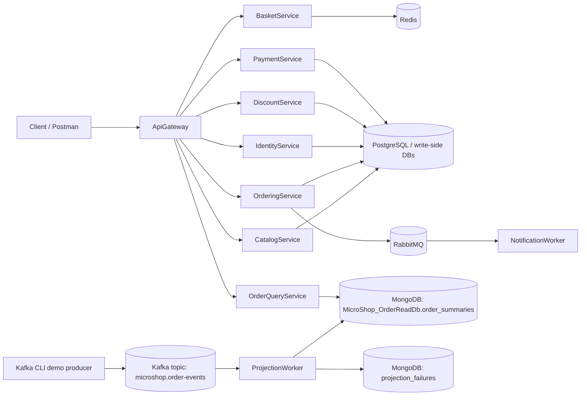

# MicroShop Architecture Diagram

## Current Stage 1 Architecture



## Messaging Roles

```text
RabbitMQ:
    workflow/task messaging
    NotificationWorker

Kafka:
    event stream/projection learning
    ProjectionWorker -> MongoDB read model
```

## Query Endpoints

```text
GET /order-summaries
GET /order-summaries/{orderId}
```

## Notes

The write-side services currently use separate logical PostgreSQL databases in local Docker. The diagram groups them as write-side DBs to avoid overclaiming a specific deployment topology.
