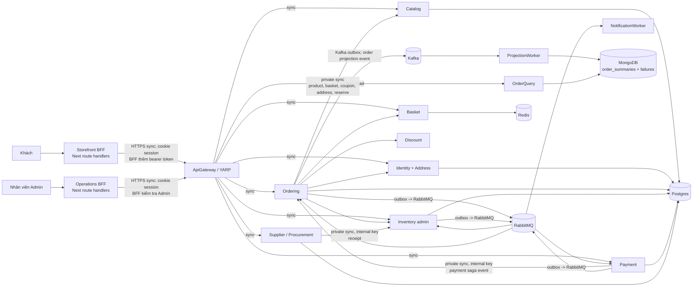

# Thiết kế hệ thống chuẩn MicroShop

## Source Of Truth

This document is the canonical product and system-design source for MicroShop. docs/governance/ defines the delivery process and quality gates; ADRs record binding architectural decisions. Historical roadmaps may provide context but cannot override this document or an accepted ADR.

## Current Capability Boundary

- The portfolio may demonstrate authenticated browsing, cart, address selection, idempotent order creation, Sandbox payment, and account order history.
- Commercial payment is not release-ready until provider credentials, signed public callback verification, duplicate and late callback drills, reconciliation, audit-backed operations, and release evidence are complete.
- Fulfillment is implemented for the portfolio path: paid-order queue, shipment lifecycle, tracking, audit history, customer tracking view, and Kafka projection are verified. Carrier API integration and warehouse execution remain outside the current boundary.
- Customer addresses and persisted order-update notification preference remain owned by IdentityService for P0. A CustomerProfile service is deferred until it gains a genuinely independent lifecycle.

> **Trạng thái:** nguồn sự thật triển khai từ 2026-08-27. Tài liệu này hợp nhất các quyết định sản phẩm/kiến trúc đang có; backlog và review cũ là bằng chứng lịch sử, không được dùng để suy diễn một capability đã hoàn thành.
> **Nguyên tắc thực thi:** chỉ coi một capability là hoàn thành khi API/BFF, phân quyền, trạng thái lỗi, persistence, telemetry và kiểm thử chứng minh được cùng một hành vi. Không tạo UI “thành công” hay service rỗng để mô phỏng nghiệp vụ.

## 1. Đích P0 và bức tranh hiện tại

P0 là hành trình mua hàng của **khách đã đăng nhập**: khám phá → giỏ → checkout có giữ tồn → khởi tạo thanh toán → webhook/saga → theo dõi đơn; cùng những công việc vận hành cần để bán hàng an toàn. P0 không bao gồm guest checkout, marketplace, đa kho, split shipment/refund, loyalty, returns/restock hoặc tự động mua hàng.

| Bounded context | Chủ sở hữu dữ liệu/quyết định | As-is | Đích gần |
| --- | --- | --- | --- |
| Catalog | sản phẩm, giá niêm yết, sellability | **Một phần** — CRUD/read API, provision tồn; contract vẫn cần chỉ trả sản phẩm sellable, media, cursor và availability chuẩn | Catalog công khai chỉ là dữ liệu mua được; tồn hiển thị là advisory |
| Basket | giỏ mutable và version của customer | **Đã có** — Redis, CRUD, ownership qua JWT, BFF che `customerId` | giỏ không giữ tồn, không tạo đơn; mutation dùng version/ETag rõ ràng |
| Identity & Profile | hiện tại: identity, JWT và address book; tương lai: profile/contact/preference | **Một phần** — register/login/me, role, address CRUD/archived/default; chưa có profile/contact/preference/revocation | giữ module Address cùng Identity trong P0; chỉ tách `CustomerProfile` khi contact/preference/audit tạo ownership độc lập thực sự |
| Ordering | order aggregate, snapshot line/giá/địa chỉ, quyết định vòng đời đơn | **Một phần** — checkout idempotent, snapshot giá/địa chỉ/coupon, order outbox và payment saga | quote/expiry/shipping/tax, status history, cancellation/refund request và customer view nhất quán |
| Inventory | on-hand, reserved, committed, khả dụng | **Một phần** — lock/hold, reserve–commit/release, expiry worker, settlement/outbox; admin read API | terminal command phải idempotent, expiry phải làm đơn không còn payable; không giao stock cho Fulfillment |
| Discount | coupon và promotion reservation | **Một phần** — lookup/apply và được Ordering gọi | coupon gắn quote/order, release/redeem theo saga; không sở hữu giá hay order |
| Payment | payment và provider reference, webhook kết quả | **Một phần** — một payment/order, HMAC + dedup webhook, outbox và capture/void/refund command | provider adapter/session thật, reconciliation late/out-of-order, public contract không nói “đã trả tiền” trước callback |
| Fulfillment | shipment, carrier, tracking và thao tác kho | **Một phần** — paid-order queue, shipment aggregate, tracking/status history, authorization, audit và event flow đã có cho portfolio | carrier API/warehouse execution, delivery exception/re-drive và SLA vận hành |
| Notification | delivery attempt/audit, không ra quyết định đơn | **Một phần** — Worker gửi SMTP qua adapter, lưu Postgres delivery + attempt audit unique theo event/template/channel; persisted preference được Identity sở hữu và lifecycle mail tôn trọng opt-out; retry exhausted được reconcile thành `DeadLetter` | re-drive có payload/version, template/channel đa dạng, provider production và delivery operations; không có public “send email” API |
| Supplier & Procurement | supplier, PO và receipt | **Một phần / ngoài critical path customer** — Spring service, admin supplier/PO/submit/receive, receipt idempotent sang Inventory, RBAC và audit đã có | recovery/reconciliation vận hành, supplier portal và mở rộng procurement policy |
| Order Query | Mongo read model của đơn | **Một phần** — ProjectionWorker, retry/DLT/dedup và query API | Ordering Kafka outbox phải là nguồn production; read model eventual, có lag/rebuild/repair runbook |

**Ranh giới dữ liệu:** mỗi service chỉ đọc/ghi database của mình. PostgreSQL là write model theo service; Redis chỉ là Basket; MongoDB chỉ là query projection/failure store; RabbitMQ là workflow/task; Kafka là event stream/projection. Không dùng gateway, Mongo hoặc broker như database chung.

## 2. Bản đồ tương tác chuẩn

**Sync API** chỉ dùng cho request cần quyết định ngay: browse/cart; address ownership/snapshot; checkout validation và reserve; khởi tạo payment; admin query/mutation. Call private phải có allow-list, timeout, retry chỉ khi idempotent và không đi qua public Gateway.

**Async event** mang việc sau commit, không phải RPC trá hình: gửi notification, capture/void/refund request, inventory settlement, status/audit, projection. Mỗi publisher ghi business data + outbox trong một transaction; dispatcher cho phép at-least-once; consumer có inbox/dedup bằng `eventId`. RabbitMQ không thay Kafka, Kafka không được ra quyết định write-side.

## 3. Luồng end-to-end

### 3.1 Khách hàng

1. **Khám phá:** Storefront đọc Catalog qua BFF/Gateway. Chỉ render product DTO server xác nhận là sellable; availability là thông tin tham khảo. Không thêm được sản phẩm inactive vào basket/checkout.
2. **Tài khoản và địa chỉ:** BFF đăng ký/đăng nhập với Identity, giữ access token phía server trong cookie `HttpOnly`; browser không nhận token. Customer chỉ truy cập `/me/addresses` của chính mình. Address bị archive không chọn được; Order lưu address snapshot bất biến, không foreign-key phụ thuộc vào address hiện tại.
3. **Giỏ:** Basket thuộc customer, mỗi mutation trả `basketId`, `version`, line và tổng hiện tại. UI gửi expected version; conflict yêu cầu refresh/chỉnh lại. Basket không reserve stock, không “paid”.
4. **Checkout và reservation:** BFF gửi `basketId`, `basketVersion`, `shippingAddressId`, coupon (nếu có), `Idempotency-Key`. Ordering kiểm tra ownership/version, lấy product snapshot, địa chỉ owned, discount và Inventory reserve. Thành công chỉ nghĩa là **đơn PendingPayment + hạn thanh toán** đã bền vững; conditional clear basket chỉ sau commit. Nếu persistence sau reserve lỗi, release là compensation và phải được ghi/quan sát.
5. **Thanh toán/webhook/saga:** `POST /payments` chỉ tạo/retrieve payment session/action. Payment xác thực HMAC webhook, dedup provider event id + payload hash, ghi payment + outbox; saga của Ordering xử lý authorization → commit inventory → request capture → Paid. Callback trễ/out-of-order không được lặng lẽ ghi đè state: void/refund hoặc đưa reconciliation queue và alert.
6. **Fulfillment/shipping (kế hoạch):** chỉ `Paid` phát `FulfillmentRequested`. Fulfillment tạo một shipment idempotent, nhân viên confirm/ship/deliver, rồi event cập nhật customer order view. Tracking chưa tồn tại thì không được hiển thị placeholder.
7. **Huỷ/hoàn tiền (một phần):** unpaid cancel/expiry giải phóng reservation/promotion; paid order tạo refund request và Payment xác nhận kết quả provider. Không cho customer tự “Cancelled” một paid/shipped order; returns/restock là ngoài P0.
8. **Thông báo:** Worker phản ứng event lifecycle sau khi state owner commit. Ghi delivery record unique `(eventId, template, channel)` trước gửi; UI hiển thị trạng thái đơn, không bịa badge “email sent”.

### 3.2 Vận hành

| Công việc | Hành vi hiện tại / hướng triển khai |
| --- | --- |
| Catalog & inventory | Operations BFF chỉ cho Admin, gọi Catalog và `/inventory/admin/items`. Product/stock mutation phải có validation, audit và refresh sau server-confirmed result; inventory reconciliation có thể read-only trước khi có adjustment policy.
| Triage đơn & payment | Đọc `/orders/admin` và `/payments/admin`; hiển thị pending/failed, `updatedAt`, correlation/trace và link đối tượng. Không expose internal saga endpoint hay nút “mark paid”. Case thất bại đi theo reconciliation/runbook, không chỉnh database.
| Fulfillment | shipment, carrier, tracking và thao tác kho | **Một phần** — paid-order queue, shipment aggregate, tracking/status history, authorization, audit và event flow đã có cho portfolio | carrier API/warehouse execution, delivery exception/re-drive và SLA vận hành |
| Supplier/procurement | Có supplier/PO/receipt admin, nhưng không nằm trên customer critical path. Chỉ promote sau khi kiểm thử role, duplicate receipt, inventory receipt, audit và operations BFF; không dùng PO như giả lập availability hay fulfillment.

## 4. State machine và bù trừ

| Owner | State và transition được phép | Idempotency, bù trừ |
| --- | --- | --- |
| Basket | `Active(vN) --mutation--> Active(vN+1) --conditional clear after checkout--> Cleared` | expected version. Retry cùng mutation key chỉ trả kết quả trước đó hoặc 409 payload khác; không reserve.
| Order | as-is: `Pending → PendingPayment → Paid`; `Pending/PendingPayment → PaymentFailed|Cancelled`; `Paid → Refunded`; enum `Confirmed/Shipped/Delivered` chưa có workflow. Target: `CheckoutRequested → PendingPayment → Paid → FulfillmentRequested → Confirmed → Shipped → Delivered`; unpaid `→ Cancelled/Expired`; paid `→ RefundPending → Refunded`. | checkout key + canonical request hash có đúng một order. CAS từ predecessor, status history/outbox cùng transaction. Late payment sau cancel: void/refund + manual reconciliation nếu không thể tự bù.
| Inventory reservation | `Reserved → Committed` hoặc `Reserved → Released/Expired`; committed không release. | `orderId + commandId` là dedup key. Repeating target state là no-op thành công, không ném lỗi. Expiry phát durable `InventoryReleased(Expired)` để Ordering đóng khả năng thanh toán.
| Payment | `PendingAuthorization → Authorized → CapturePending → Captured`; `Authorized/CapturePending → VoidPending → Voided`; `Captured → RefundPending → Refunded`; `PendingAuthorization → Failed`. | provider event id + payload hash unique; webhook hợp lệ nhưng duplicate trả kết quả hiện có. Mọi transition sai thứ tự được ghi/audit và reconciliation, không retry mù.
| Fulfillment | `Requested → Confirmed → Shipped → Delivered`; `Requested/Confirmed → Failed|Cancelled`. | unique order/fulfillment event; expected version + key trên thao tác nhân viên; tracking bắt buộc trước ship; không giảm stock. |
| Notification | `Queued → Sending → Sent | RetryableFailure | DeadLetter` | delivery unique theo event/template/channel; persisted preference được kiểm tra trước lifecycle mail; retry có backoff và DLQ, không đổi order state. |
| Procurement (partial) | `Draft → Submitted → Received` | receipt ID unique xuyên Supplier–Inventory; duplicate receipt không tăng stock lần hai. Không allow receipt sau terminal state.

## 5. Hợp đồng, quyền và PII

### Gateway/BFF boundary

- Browser chỉ gọi route BFF allow-list (`/api/...`). BFF validate runtime payload, same-origin/CSRF cho unsafe method, lấy session và gắn token khi gọi Gateway. Không gọi container, broker, DB hoặc `/_internal/*` từ browser.
- Gateway là public anti-corruption boundary, không chứa business rule. Các endpoint hiện hữu chưa version; endpoint mới public đi qua `/api/v1/...` ở Gateway, có deprecation window và compatibility test. API internal được private network + internal key/mTLS; không proxy qua Caddy/Gateway public.
- Customer dùng ownership `404` khi object không thuộc mình; Admin chỉ có capability operations đã cấp. `401` = thiếu/expired session; `403` = có danh tính nhưng thiếu quyền/CSRF; `409` = idempotency/version/state conflict; `422` = business rule không thoả; `429` = rate limited; `503` = retryable upstream.
- Error dùng ProblemDetails với `type`, `title`, `status`, `code` ổn định, `traceId/correlationId` và field validation khi có; không leak token, stack trace, provider secret, raw downstream response hay data của customer khác.

### Dữ liệu và event

- DTO public là view model: không expose entity/DB schema. Money = amount + ISO currency; timestamps UTC; trạng thái là enum/string được document; list có cursor/limit/filter/sort rõ ràng.
- Command có hiệu ứng bắt buộc `Idempotency-Key`; same key + request hash khác trả 409. Event có `eventId`, event type namespaced, `schemaVersion`, `source`, `subject`, `occurredAtUtc`, `correlationId`, `causationId`, `data`. Envelope CloudEvents là target; payload Rabbit/Kafka legacy được migrate dần bằng dual consumer/compatibility test.
- PII chỉ tồn tại ở Identity/Profile và immutable order snapshot tối thiểu cần để fulfil. Không đưa address/contact vào Kafka projection, metrics labels, log hoặc notification event trừ recipient snapshot tối thiểu trong store bảo vệ. Payment không lưu card/raw secret.

## 6. Delivery map

| Ưu tiên / vertical slice | Frontend & BFF | Backend & contract | Tests, quan sát và tiêu chí nhận |
| --- | --- | --- | --- |
| **P0-0: security + lifecycle gate** | BFF exact-origin/CSRF, route allow-list, session cookie server-only; mọi UI pending/failed/retry có thật | trusted proxy/rate-limit, internal routes private, reservation expiry → durable Ordering decision; terminal reserve/release/commit idempotent | route handler negative tests; cross-origin/customer-ownership/admin tests; metrics outbox/inbox/reconciliation; pass khi expiry làm order non-payable và duplicate command/event không đổi kết quả |
| **P0-1: account/address thật** | Account/address list-create-edit-archive-default, server errors và refresh | hiện tại giữ Identity Address module; ownership, idempotent create, snapshot private query cho Ordering | API/BFF/browser E2E: A không đọc B, archived không checkout, default concurrent deterministic; audit `address.*` tối thiểu |
| **P0-2: quote → checkout → payment** | checkout hiển thị quote/expiry/line totals; disable duplicate submit; payment action từ server | quote snapshot, shipping/tax policy trong Ordering, basket version, reserve deadline = payment deadline, provider adapter/signed webhook/saga | integration: one key = one order/reservation; stale quote/stock/coupon/address safe; sandbox webhook drives paid once; trace nối BFF–Gateway–service–event |
| **P0-3: customer order/payment status** | order history/detail chỉ own order; pending/eventual copy rõ; no local terminal state | stable order/payment read DTO, status history, reconciliation marker có quyền xem | ownership and idempotent callback tests; UI handles loading/empty/401/403/409/503; alert on stuck saga/late capture |
| **P0-4: cancellation/refund** | Cancel chỉ khi server `eligible`; refund request/status; Operations approval queue có reason/audit | Ordering policy/request aggregate; Payment void/refund request via event; inventory/discount release once | duplicate/late/failed provider tests; shipped cancel denied; paid refund exactly once; support trace/audit available |
| **P0-5: fulfillment & notification** | Admin paid queue/confirm/ship/deliver; customer tracking read only; preferences only when persisted | Fulfillment aggregate/outbox/inbox; lifecycle events; Notification delivery/audit/retry | duplicate paid event creates one shipment; tracking required before ship; delivery unique; E2E state flows via broker, lag/DLQ dashboard and repair runbook |
| **P1: procurement hardening** | supplier/PO/receipt working forms, no seeded “stock health” claims | complete Supplier receipt invariant and Inventory integration; audit + limit/pagination | role/duplicate receipt/concurrency E2E; PO state never affects sellability except actual Inventory receipt |
| **P1: read-model & platform hardening** | surfaces `updatedAt`/refresh for eventual data, not false real-time | versioned Kafka envelope, projection rebuild/atomicity strategy, revocable sessions/refresh, external IdP decision | replay/compatibility/restore/rollback drills; frontend browser suite in CI; operational alert routing and retention policy |

## 7. Guardrail production-minded

- **Consistency:** local transaction + outbox; at-least-once delivery; inbox/dedup; explicit CAS. Synchronous checkout may reserve but must compensate and record repair when final write fails. Mongo never authorizes payment/order action.
- **Security:** no dev debug/internal routes outside development; secrets only configuration/secret store; exact allowed origins, HTTPS/Secure cookie in public profile, CSP/HSTS on owned HTTPS host, trusted forwarded headers before IP rate limiting, signed webhook verification and least-privilege roles. Current JWT/logout is not revocable — not real-customer ready.
- **Audit:** append-only business/security audit for login, catalog/stock/PO mutation, checkout, payment webhook/status, cancellation/refund and fulfillment. Include actor, action, entity, before/after where safe, result, correlation/trace and source IP; never credentials/JWT/raw payment.
- **Observability:** OpenTelemetry trace propagation, structured logs without PII, health `/alive` vs readiness `/health`, outbox age/failure, inbox duplicate, saga age, reservation expiry, payment webhook rejection, Kafka lag/DLT/projection failure, inventory mismatch. Alerts need owned routing, not merely Prometheus rules.
- **Deploy/rollback:** expand–migrate–contract schema change; backward-compatible API/event first; versioned image/config; readiness gates; backup manifest + checksum; canary/rollback app only when migration is compatible. Restore is deliberate, audited and destructive; practise payment/replay reconciliation after restore.

## 8. Không xây ngay

- Không tách CustomerProfile, Shipping, Tax, Promotion, Search hay Fulfillment chỉ để có thêm service. P0 có thể để shipping policy trong Ordering; chỉ extract khi ownership, scale hoặc lifecycle riêng được chứng minh.
- Không làm dashboard analytics, metric “health score”, tracking, email sent, stock available, payment success hoặc order confirmed bằng mock/local state.
- Không expose `/_internal`, database, broker command, debug route hay direct service port cho frontend/operations. Không để Operations sửa state order/payment bằng generic CRUD.
- Không dùng Kafka để điều phối transactional saga hay RabbitMQ để dựng read model; không hứa exactly-once.
- Không thêm guest cart/merge, multi-warehouse/allocation, marketplace, split fulfilment/refund, returns/restock, loyalty, recommendation/search engine hoặc public supplier portal trước P0 acceptance.

## 9. System Design v2: product-first delivery target

### 9.1 Quyết định kiến trúc đã chốt

- Không tách thêm service chỉ để mô phỏng enterprise. `Fulfillment` bắt đầu là bounded module có aggregate, persistence, API và event rõ ràng trong `OrderingService`; chỉ tách `FulfillmentService` khi multi-warehouse, multi-shipment, WMS/carrier integration hoặc ownership vận hành riêng tạo áp lực thực tế.
- `InventoryService` là owner duy nhất của `onHand`, `reserved`, `committed` và `available`. `CatalogService` chỉ sở hữu product, price, sellability và availability snapshot advisory. Không để Operations thực hiện product update và stock update như một transaction UI giả.
- `OrderingService` sở hữu quote/price snapshot, shipping/tax policy P0, status history, cancellation policy và order lifecycle. `PaymentService` sở hữu provider action, webhook, reconciliation và payment lifecycle; browser không xác nhận payment thành công.
- `SupplierService` giữ độc lập bằng Spring Boot. Procurement không nằm trên customer critical path cho tới khi receipt-to-stock, role, audit và duplicate protection được chứng minh end-to-end.
- Tất cả browser traffic vẫn theo Browser -> BFF -> ApiGateway. BFF chỉ expose capability allow-list, không phải reverse proxy tổng quát; browser không gọi service, broker, database hoặc endpoint `/_internal/*`.
- Dữ liệu hiển thị cho user phải là dữ liệu thật từ owner database qua API/BFF. Không hard-code catalog, order, payment, inventory, metric hoặc timeline giả trong frontend. Portfolio seed là dữ liệu demo có thật: tạo idempotent qua API/import workflow, persist vào database và được gắn nhãn synthetic; production master data được quản lý bằng admin workflow/import có audit, không nhét vào DbUp migration sau bootstrap.

### 9.2 Target information architecture

Các route dưới đây là **đích triển khai**, không được coi là capability đã có cho tới khi contract, quyền, persistence, telemetry và browser E2E cùng hoàn thành.

| Surface | Route / area target | Quyết định UX và contract |
| --- | --- | --- |
| Storefront discovery | `/`, `/products`, `/products/{productId}` | Listing có query/filter/sort/cursor khi Catalog hỗ trợ; product detail là URL shareable với media, price, sellability và availability advisory đã được server xác nhận. |
| Storefront purchase | `/cart`, `/checkout` | Giỏ và checkout là page flow, không nhồi toàn bộ vào drawer; checkout hiển thị quote, tổng tiền, hạn reservation/payment và lỗi có thể phục hồi. |
| Storefront account | `/account`, `/account/addresses`, `/orders`, `/orders/{orderId}` | Account, address book, order detail và status timeline là các màn hình recoverable; chỉ hiển thị cancel/refund/tracking khi server trả action hợp lệ. |
| Storefront payment | `/orders/{orderId}/payment` hoặc provider return route | UI render provider action/return state do Payment trả về; pending/failed/retry/reconciliation không được suy diễn từ thao tác click. |
| Operations catalog/inventory | `/catalog`, `/catalog/{productId}`, `/inventory` | Catalog editor tách khỏi stock policy; inventory reconciliation trước hết read-only, mutation chỉ xuất hiện sau command/audit/idempotency rõ. |
| Operations case work | `/orders`, `/orders/{orderId}`, `/payments`, `/payments/{paymentId}` | Queue -> detail -> permitted action; detail có snapshot, state timeline, updated time, correlation/trace và runbook/reconciliation context nếu contract cấp. |
| Operations fulfilment | `/fulfillment`, `/fulfillment/{id}` | Chỉ tạo sau paid-order queue, expected version, confirm/ship/deliver, carrier/tracking bắt buộc và audit đã tồn tại. |
| Operations procurement | `/procurement` | Chỉ hiển thị workflow supplier -> PO -> receipt khi Gateway contract và receipt-to-stock idempotency đã chứng minh; nếu chưa, ẩn thay vì gắn nhãn placeholder như capability hoàn chỉnh. |

### 9.3 Vertical slice delivery order

1. **Foundation UX and contracts:** tách Storefront client workspace thành page/route theo domain, typed BFF adapters, common error states (`401`, `403`, `409`, `422`, `429`, `503`), session/role guard chung và browser test baseline. Không thay đổi business state machine ở bước này.
2. **Discovery and product detail:** Catalog sellable read contract, cursor/filter/sort chỉ khi có persistence/index; product detail page và media policy. Không tách SearchService ở P0.
3. **Quote to checkout:** quote + expiry, tax/shipping breakdown P0, cart conflict recovery, checkout review page, customer order detail/status history. Một key chỉ tạo một order/reservation.
4. **Payment completion:** provider adapter boundary, hosted/redirect action hoặc equivalent server-confirmed action, return/callback state, pending/failed/retry UX và payment reconciliation queue. Sandbox chỉ cho Development/Portfolio; real payment cần commercial provider adapter.
5. **Fulfilment:** `Paid -> FulfillmentRequested -> Confirmed -> Shipped -> Delivered`, paid-order queue, carrier/tracking validation, customer order tracking read view, audit và idempotent event handling.
6. **Cancel and refund:** server-calculated eligibility, customer request reason, Operations review khi policy cần, void/refund exactly-once, reservation/promotion compensation và late callback reconciliation.
7. **Notification and procurement hardening:** delivery record/provider/template/preference/retry/DLQ; receipt retry/recovery and audit. Không dùng sender log hoặc seeded data để khẳng định delivery/stock health.
8. **Scale and release hardening:** SLO/load model, browser E2E in CI, contract compatibility, durable traces/logs, alert routing, encrypted off-host backups and timed restore drills; sau đó mới đặt mục tiêu multi-node/HA.

### 9.4 Slice acceptance gate

Một slice chỉ được promote khi toàn bộ điều kiện sau pass:

- API/BFF có authorization, ownership, idempotency và response/error contract ổn định.
- Domain transition có predecessor hợp lệ, CAS/expected version khi cạnh tranh, transaction + outbox và consumer dedup theo `eventId` khi đi async.
- UI có loading, empty, validation, pending, retryable unavailable, conflict và confirmed success; không có optimistic terminal business state.
- Browser E2E kiểm tra primary flow, duplicate submit, unauthorized/cross-user access và một failure state có ý nghĩa; accessibility có keyboard/focus/axe coverage.
- Trace nối Browser/BFF -> Gateway -> service -> event/worker; log không lộ PII/payment secret; metric/alert/runbook tồn tại cho queue/outbox/saga liên quan.
- Migration, rollback compatibility và recovery behavior được chứng minh trên composed runtime, không chỉ unit test.

### 9.5 Release classification

| Mức | Điều kiện |
| --- | --- |
| Portfolio supervised demo | Synthetic data, exact HTTPS origin/cookie, clean compose smoke, customer/admin journey smoke, no real payment, Quick Tunnel được xem là tạm thời. |
| Pilot with real users | Commercial payment provider, fulfilment/cancel/refund, delivery notification, session revocation, audit, browser E2E, SLO/load verification, alert routing, encrypted off-host backup và restore drill. |
| High-availability production | Tách failure domain dữ liệu/hạ tầng, replicated or managed data services, capacity/autoscaling plan, PDB/network policy, owned domain/named tunnel or ingress, disaster-recovery RPO/RTO đã kiểm thử. Single-VPS K3s không được gọi là HA. |
## 9. Rủi ro quyết định cần đóng

1. README/legacy architecture docs có thể mô tả trước trạng thái hiện hành (ví dụ route/service mới và Kafka outbox). Khi khác nhau, source + composed runtime + test là bằng chứng; cập nhật tài liệu cũ ở một thay đổi riêng, không nhân đôi blueprint.
2. Address đang nằm trong Identity là coupling tạm chấp nhận được. Chỉ tách Profile khi preference/contact lifecycle và quyền vận hành được đưa vào cùng một slice có migration, ownership và E2E rõ ràng.
3. Payment/provider integration, reservation expiry và callback trễ là rủi ro tiền/tồn lớn nhất. Không mở public customer traffic khi reconciliation, session revocation, CSP/HSTS, trusted proxy/rate limit, browser tests và alert routing còn thiếu.
4. Supplier/Procurement không được dùng để chứng minh ecommerce checkout. Nó là workstream độc lập và chỉ được quảng bá khi receipt-to-stock, audit và duplicate protection đã chứng minh trong composed runtime.
