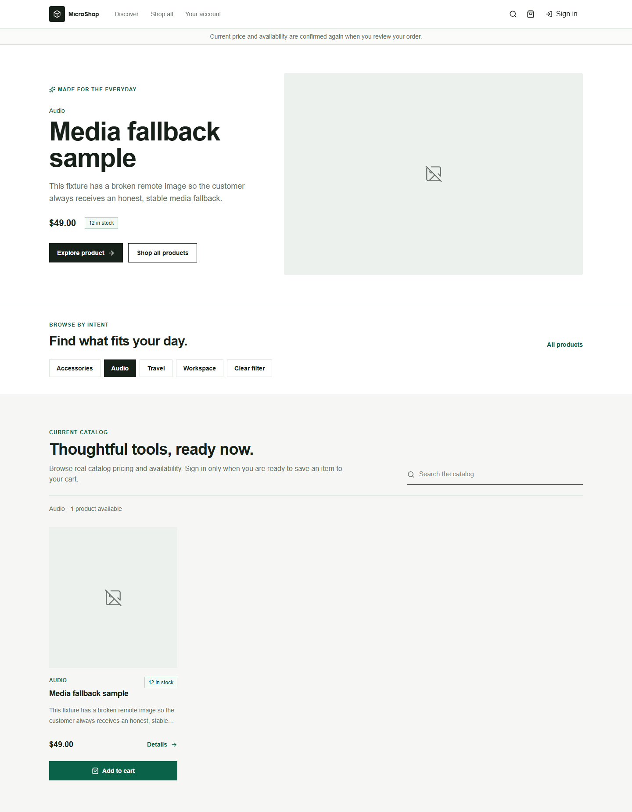
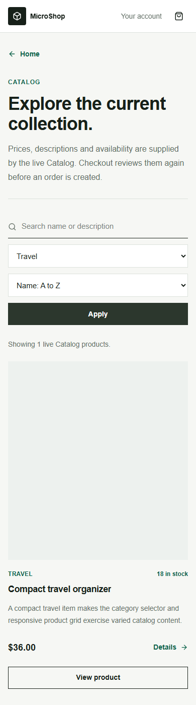
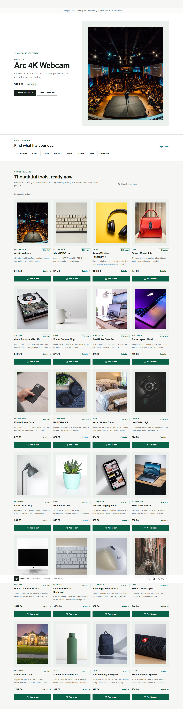
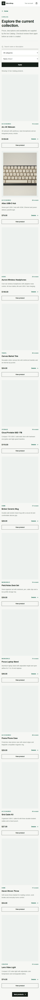

# Storefront Browser QA Test Cases

- Scope: customer catalog discovery and product-card interaction
- Test environment: deterministic Storefront BFF fixture, Chromium, 2026-09-02
- Data source: `Frontend/e2e/tests/mock-gateway.mjs`; production seed quality is checked separately from `data/portfolio/catalog-products.csv`.
- Automation: `corepack pnpm --dir Frontend/e2e test`
- Result: PASS, 6/6 deterministic browser scenarios; live visual smoke passes against the portfolio Catalog.

## Evidence

### Desktop catalog: aligned actions and broken-media fallback



The Audio filter selects the one Audio product. Its intentionally failed remote image is rendered as an explicit fallback, while product cards use a fixed media stage and a stable action row.

### Mobile catalog: selectable categories and no horizontal overflow



The category is selected from a controlled list rather than typed by the customer. The narrow viewport has no horizontal document overflow.

## Public Runtime Evidence

The following screenshots were captured after the verified CSV was seeded into the running Catalog through the Gateway. They prove the live data path, rather than only the deterministic fixture.




## Test Cases

| ID | Scenario | Steps | Expected result | Automated evidence |
| --- | --- | --- | --- | --- |
| SF-UI-001 | Stable product-card actions | Open `/` at 1440 px with catalog fixtures containing unequal titles and descriptions. | All first-row **Add to cart** buttons share the same vertical baseline; image area, text and CTA do not overlap. | `storefront-visual.spec.ts` checks button Y coordinates with a tolerance of 1 px. |
| SF-UI-002 | Failed remote product image | Abort the fixture media URL `https://media.test/broken-product.webp`; open `/`. | A labelled neutral fallback replaces the failed image. The card remains the same size and no broken-image icon is exposed. | `data-testid=product-image-fallback`; desktop evidence above. |
| SF-UI-003 | Home category discovery | Open `/`; choose **Audio** in the derived category row. | Catalog is filtered to the selected category, the selected chip remains visible, and customer does not need to type a category. | Browser scenario `catalog cards stay aligned...`. |
| SF-UI-004 | Catalog category selector | Open `/products`; choose **Travel** from **Product category** and apply. | Only Travel result is shown; filter value is preserved in the URL query. | Browser scenario `catalog filters remain usable...`. |
| SF-UI-005 | Mobile responsive catalog | Run `/products` at 390 x 844. | No horizontal page overflow, filter controls are reachable and the product card stays within the viewport. | `document.documentElement.scrollWidth <= window.innerWidth`; mobile evidence above. |
| SF-UI-006 | Existing authenticated purchase entry | Sign in, open product detail, add a product, open cart, then checkout. | Existing BFF-session and cart-to-checkout path still works. | `storefront-session.spec.ts`. |
| SF-UI-007 | Dialog keyboard behavior | Open the sign-in and product dialogs from their triggering buttons, then press Escape. | Initial focus reaches the intended control; Escape closes the dialog; focus returns to the original trigger. | `storefront-visual.spec.ts`. |
| SF-UI-008 | Cart and address setup ergonomics | Sign in, open the empty cart, open the address form. | Cart is a semantic keyboard dialog; focus is contained; country is selected from a controlled list rather than typed. | `storefront-visual.spec.ts`. |

## Catalog Data Quality Gate

Run before portfolio seed or deployment:

```powershell
powershell -ExecutionPolicy Bypass -File .\scripts\test-portfolio-catalog-media.ps1
```

The script rejects missing SKU/name/description/category/brand/media, duplicate SKUs, fewer than four customer-selectable categories, descriptions shorter than 40 characters, non-positive prices, malformed URLs and unreachable image URLs. Current curated data contains 24 products across 8 categories and all 24 media URLs returned success during this QA run.

Run the live visual smoke after seed/deployment:

```powershell
$env:STOREFRONT_VISUAL_SMOKE_BASE_URL = "https://your-public-storefront"
$env:STOREFRONT_VISUAL_SMOKE_SCREENSHOT_DIR = "../../docs/qa/evidence"
corepack pnpm --dir Frontend/e2e exec node scripts/storefront-live-visual-smoke.mjs
```

## Acceptance Boundary

These screenshots use deterministic fixture data so visual regressions are repeatable. The public runtime evidence is refreshed by `storefront-live-visual-smoke.mjs` after each approved portfolio deployment. Live catalog smoke remains required after seed because the real Catalog is the source of truth. Public placeholder photography is suitable for the portfolio seed only; before commercial launch, replace it with owned, licensed or supplier-authorized product assets and retain source/usage records outside the browser.